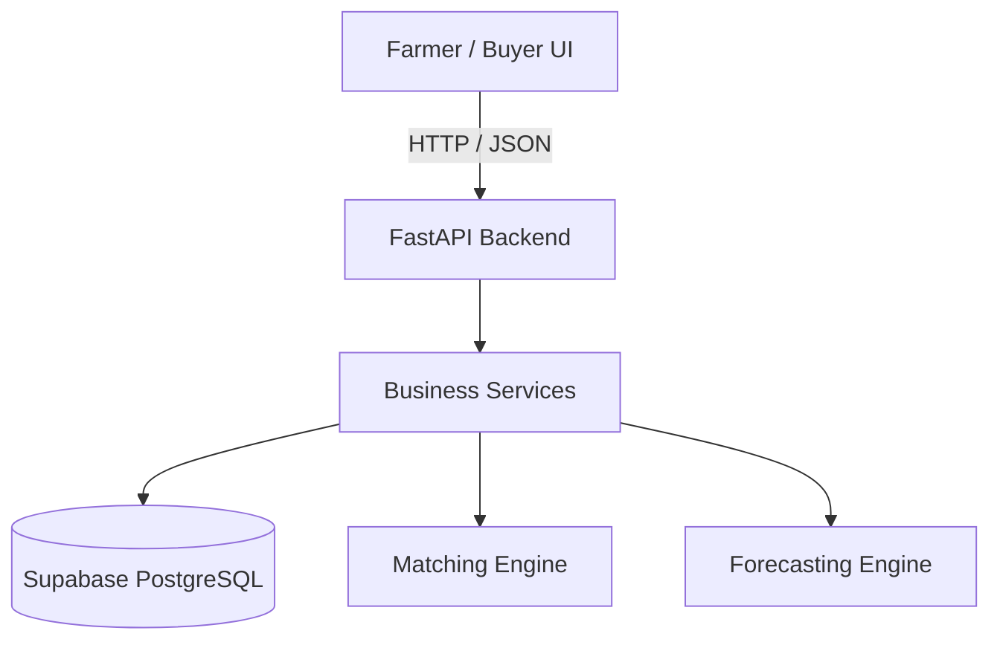

# Krishi Bazaar — SIH26132 (backend)

[](krishi_bazaar_sih.postman_collection.json)

Market linkage and price discovery API for farmers (Government of Maharashtra / MSInS).

This repository is the **FastAPI + Supabase backend**. Farmer/buyer UI lives in a **separate frontend repo**. HTTP contract: [`docs/API.md`](docs/API.md). Layout: [`docs/ARCHITECTURE.md`](docs/ARCHITECTURE.md). How to contribute: [`CONTRIBUTING.md`](CONTRIBUTING.md).

## Problem → API

| SIH expected | This API |
|---|---|
| Aggregate mandi prices, arrivals, demand, logistics | `GET /prices/*` ingest from data.gov.in; `GET /buyers/`; `GET /logistics/` |
| Localised price trends + sale-window | `GET /sale-window/?lang=mr` → **Sell Now / Hold / Wait** |
| Match farmers/FPOs to verified buyers | `GET /lots/{id}/matches` and `/advice` (local-first score) |
| Lots, grading, digital offers, payments | `/lots/` `/offers/` `/payments/` |
| Logistics + disputes | `/logistics/bookings` `/grievances/` |
| Transparent record | `GET /lots/{id}/ledger` |

### Architecture


### Tech Stack Justification
- **FastAPI**: Chosen for its high-performance async capabilities and automatic OpenAPI (Swagger) documentation, ensuring rapid API development.
- **Supabase (PostgreSQL)**: Selected over NoSQL to ensure strict relational integrity (ACID) for financial transactions, lots, and ledgers. Row Level Security (RLS) handles data isolation.
- **Pydantic**: Guarantees pre-route validation so the API never processes malformed data.

Demo seed: 5 Nashik APMCs × Onion, Tomato, Soybean, Maize. Expand via [`docs/ONBOARDING.md`](docs/ONBOARDING.md).

## Prerequisites

- **Python 3.14** (this repo does not support 3.12)
- A Supabase project (SQL applied per [`docs/SQL_APPLY.md`](docs/SQL_APPLY.md))
- Optional: Docker + Compose for a one-command API

## Local setup (Windows)

```bat
py -3.14 -m venv .venv
.venv\Scripts\activate
pip install -r requirements-dev.txt
copy .env.example .env
```

Fill `.env` (never commit it). Apply SQL `001`–`011` once.

**Seed the database**:
```bat
python seed.py
```

```bat
set RUN_SCHEDULER=0
set RATE_LIMIT_ENABLED=0
uvicorn app.main:app --host 127.0.0.1 --port 8000
```

- Health: `http://127.0.0.1:8000/health`
- OpenAPI (non-production): `http://127.0.0.1:8000/docs`
- Frontend origin: `CORS_ORIGIN` (comma-separated). Default includes `http://localhost:3000` and `http://localhost:5173`.

Unix / Make:

```bash
make install-dev
RUN_SCHEDULER=0 RATE_LIMIT_ENABLED=0 make run
```

## Environment variables

All keys are listed with comments in [`.env.example`](.env.example). Required to boot:

| Variable | Purpose |
|---|---|
| `SUPABASE_URL` | Project URL |
| `SUPABASE_ANON_KEY` | Public reads (RLS) |
| `SUPABASE_SERVICE_ROLE_KEY` | Jobs + authenticated handlers (never expose) |
| `SUPABASE_JWT_SECRET` | FastAPI HS256 verify |
| `DATA_GOV_IN_API_KEY` | Mandi ingest |

Important knobs: `CORS_ORIGIN`, `RUN_SCHEDULER`, `RATE_LIMIT_ENABLED`, `APP_ENV`, `INBOUND_HMAC_SECRET`, `TARGET_DISTRICT`.

The API **verifies** JWTs itself. It does **not** forward minted HS256 tokens to PostgREST.

## Tests

```bat
set RUN_SCHEDULER=0
set RATE_LIMIT_ENABLED=0
ruff check app ingestion forecasting notifications tests demo scripts
pytest -q
```

Offline: FakeSupabase, no network. Live checks (uvicorn + real `.env`):

```bat
python scripts/test_db.py
python demo/reconcile.py
python demo/live_smoke.py
```

Judge path: [`docs/DEMO.md`](docs/DEMO.md).

## Docker

Single worker is required (in-process scheduler + job locks).

```bash
docker compose up --build
```

Or:

```bash
docker build -t krishi-bazaar .
docker run --env-file .env -p 8000:8000 krishi-bazaar
```

Production image installs **only** `requirements.txt` (no pytest/ruff) and runs as uid 10001. Set `APP_ENV=production` to disable `/docs`.

## Auth (frontend)

`Authorization: Bearer <jwt>`. Role comes from `user_profiles`, not the token.

```bat
python demo/mint_admin_token.py --sub <auth.users uuid> --hours 2
```

Elevate only in SQL:

```sql
select public.admin_set_role('<uuid>'::uuid, 'admin');
```

## Farmer / FPO sequence

1. `PATCH /api/v1/me/` — phone E.164, `mr|hi|en`, lat/lng, district
2. `POST /api/v1/lots/` — qty, grade (`FAQ|General|Special`), asking price
3. `GET /api/v1/lots/{id}/advice` — Sell Now / Hold + **best local verified buyer**
4. `GET /api/v1/lots/{id}/matches`
5. `POST /api/v1/offers/` (48h TTL) → accept → `POST /api/v1/payments/` → `paid|failed|disputed`
6. `GET /api/v1/lots/{id}/ledger`
7. `POST /api/v1/grievances/` if quality / payment / logistics fails
8. `POST /api/v1/logistics/bookings` against a lot (capacity-checked)
9. FPO: `POST /api/v1/lots/aggregate`

SMS: registered number texts `PYAJ` / `कांदा` → modal + sale-window + buyer. Unknown MSISDNs are ignored.

Admin JWT (DB role `admin`): forecast/alert jobs, buyer verify, `/dashboard` (ops HTML only).

## Layout

```
app/              HTTP app (routers, schemas, auth, errors)
app/services/     Core business logic and engines
ingestion/        mandi adapters
forecasting/      7-day forecast engine
notifications/    sale-window + SMS
db/migrations/    Postgres / RLS
tests/            pytest + FakeSupabase
docs/             API, SQL, demo, architecture
demo/             live smoke / token mint
scripts/          operator helpers
```

Runtime config is environment variables, not a `config/` directory.

## CI

Every push/PR: Ruff, pytest (Python 3.14), `pip-audit` on production deps, secret-pattern grep. See `.github/workflows/ci.yml`.
